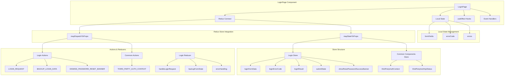

# LoginPage.jsx - Архитектура и Store

## Обзор

`LoginPage.jsx` - это React-компонент страницы входа в систему, который использует Redux для управления состоянием и взаимодействует с несколькими store для обработки аутентификации пользователей.

## Архитектура компонента



## Store Structure

### 1. Login Store (`state.login`)

Основной store для управления состоянием страницы входа:

```javascript
{
  loginFormData: {
    formFields: {
      emailOrUsername: '',
      password: ''
    },
    errors: {
      emailOrUsername: '',
      password: ''
    }
  },
  loginErrorCode: '',
  loginErrorContext: {},
  loginResult: {
    redirectUrl: '',
    success: false
  },
  shouldBackupState: false,
  showResetPasswordSuccessBanner: false,
  submitState: 'default' | 'pending'
}
```

**Ключевые поля:**
- `loginFormData` - резервная копия данных формы
- `loginErrorCode` - код ошибки аутентификации
- `loginResult` - результат попытки входа
- `submitState` - состояние кнопки отправки

### 2. Common Components Store (`state.commonComponents`)

Store для управления контекстом сторонней аутентификации:

```javascript
{
  thirdPartyAuthApiStatus: 'pending' | 'complete' | 'failure',
  thirdPartyAuthContext: {
    currentProvider: null,
    providers: [],
    secondaryProviders: [],
    finishAuthUrl: null,
    platformName: '',
    errorMessage: null
  }
}
```

## Actions и Reducers

### Login Actions

```javascript
// Основные действия
LOGIN_REQUEST.BASE      // Запрос на вход
LOGIN_REQUEST.BEGIN     // Начало процесса входа
LOGIN_REQUEST.SUCCESS   // Успешный вход
LOGIN_REQUEST.FAILURE   // Ошибка входа

// Управление состоянием формы
BACKUP_LOGIN_DATA.BASE  // Флаг для резервного копирования
BACKUP_LOGIN_DATA.BEGIN // Резервное копирование данных

// Управление баннерами
DISMISS_PASSWORD_RESET_BANNER // Скрытие баннера сброса пароля
```

### Common Components Actions

```javascript
// Получение контекста сторонней аутентификации
THIRD_PARTY_AUTH_CONTEXT.BASE    // Запрос контекста
THIRD_PARTY_AUTH_CONTEXT.BEGIN   // Начало запроса
THIRD_PARTY_AUTH_CONTEXT.SUCCESS // Успешное получение
THIRD_PARTY_AUTH_CONTEXT.FAILURE // Ошибка получения
```

## Жизненный цикл компонента

### 1. Инициализация
```javascript
useEffect(() => {
  sendPageEvent("login_and_registration", "login");
}, []);

useEffect(() => {
  const payload = { ...queryParams };
  if (tpaHint) {
    payload.tpa_hint = tpaHint;
  }
  getTPADataFromBackend(payload);
}, [getTPADataFromBackend, queryParams, tpaHint]);
```

### 2. Резервное копирование состояния
```javascript
useEffect(() => {
  if (shouldBackupState) {
    backupFormState({
      formFields: { ...formFields },
      errors: { ...errors },
    });
  }
}, [shouldBackupState, formFields, errors, backupFormState]);
```

### 3. Обработка ошибок
```javascript
useEffect(() => {
  if (loginErrorCode) {
    setErrorCode((prevState) => ({
      type: loginErrorCode,
      count: prevState.count + 1,
      context: { ...loginErrorContext },
    }));
  }
}, [loginErrorCode, loginErrorContext]);
```

## Валидация формы

Компонент выполняет клиентскую валидацию перед отправкой:

```javascript
const validateFormFields = (payload) => {
  const { emailOrUsername, password } = payload;
  const fieldErrors = { ...errors };

  if (emailOrUsername === "") {
    fieldErrors.emailOrUsername = formatMessage(
      messages["email.validation.message"]
    );
  } else if (emailOrUsername.length < 2) {
    fieldErrors.emailOrUsername = formatMessage(
      messages["username.or.email.format.validation.less.chars.message"]
    );
  }
  
  if (password === "") {
    fieldErrors.password = formatMessage(
      messages["password.validation.message"]
    );
  }

  return { ...fieldErrors };
};
```

## Обработка событий

### Submit формы
```javascript
const handleSubmit = (event) => {
  event.preventDefault();
  
  // Скрытие баннера сброса пароля
  if (showResetPasswordSuccessBanner) {
    props.dismissPasswordResetBanner();
  }

  // Валидация
  const formData = { ...formFields };
  const validationErrors = validateFormFields(formData);
  
  if (validationErrors.emailOrUsername || validationErrors.password) {
    setErrors({ ...validationErrors });
    setErrorCode((prevState) => ({
      type: INVALID_FORM,
      count: prevState.count + 1,
      context: {},
    }));
    return;
  }

  // Отправка запроса
  const payload = {
    email_or_username: formData.emailOrUsername,
    password: formData.password,
    ...queryParams,
  };
  props.loginRequest(payload);
};
```

## Интеграция с Redux

Компонент подключается к Redux через `connect`:

```javascript
const mapStateToProps = (state) => {
  const loginPageState = state.login;
  return {
    backedUpFormData: loginPageState.loginFormData,
    loginErrorCode: loginPageState.loginErrorCode,
    loginErrorContext: loginPageState.loginErrorContext,
    loginResult: loginPageState.loginResult,
    shouldBackupState: loginPageState.shouldBackupState,
    showResetPasswordSuccessBanner: loginPageState.showResetPasswordSuccessBanner,
    submitState: loginPageState.submitState,
    thirdPartyAuthContext: thirdPartyAuthContextSelector(state),
    thirdPartyAuthApiStatus: state.commonComponents.thirdPartyAuthApiStatus,
  };
};

export default connect(mapStateToProps, {
  backupFormState: backupLoginFormBegin,
  dismissPasswordResetBanner,
  loginRequest,
  getTPADataFromBackend: getThirdPartyAuthContext,
})(injectIntl(LoginPage));
```

## Особенности архитектуры

1. **Гибридное управление состоянием**: Локальное состояние для формы + Redux для глобального состояния
2. **Резервное копирование**: Автоматическое сохранение состояния формы при переключении страниц
3. **Обработка ошибок**: Многоуровневая система обработки ошибок с контекстом
4. **Интеграция с TPA**: Поддержка сторонних провайдеров аутентификации
5. **Интернационализация**: Поддержка многоязычности через `injectIntl`

## Зависимости

- **Redux**: Управление состоянием
- **Redux-Saga**: Асинхронные операции
- **React-Router**: Навигация
- **@edx/frontend-platform**: Аналитика и конфигурация
- **@openedx/paragon**: UI компоненты
